**TASK REQUIREMENTS; **

Use terraform to create cloud tools (especially the network and Cloud Run) 

Create 2 services, make one accessible from the public internet and the other service private. 

Ensure the public-facing service can reach the private one to call an endpoint and then display a response from the private service. 

Create a CICD pipeline using cloudBuild 

**IMPLEMENTATION** 

**STAGE 1:** setup environment for terraform and the code for the servise 

1. Installed Google Cloud SDK and Terraform on my local machine. Links below 

Google Cloud SDK: https://cloud.google.com/sdk/docs/install 

Terraform: https://learn.hashicorp.com/tutorials/terraform/install-cli 

2. Set up a GitHub repository that you have a GitHub repository with the Dockerfile you want to use for your Cloud Run service. 

3. Link the GitHub Repository to Azure repositories 

4. Connected a new host  

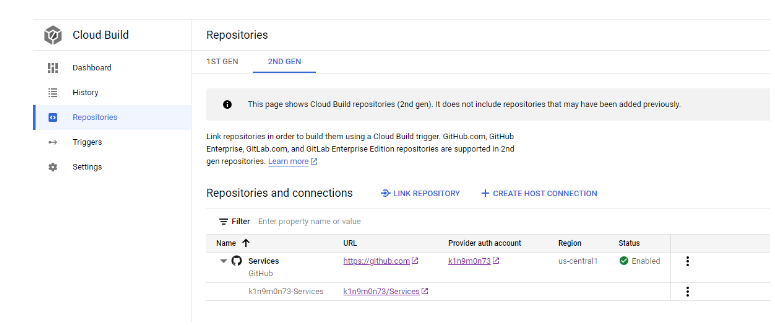
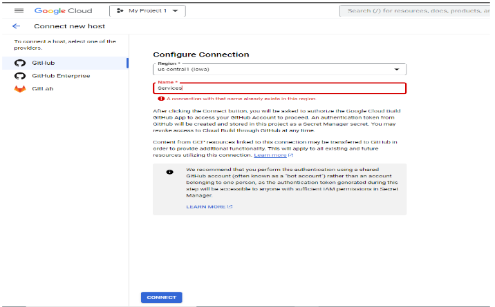

5. Link the Repositories 
 
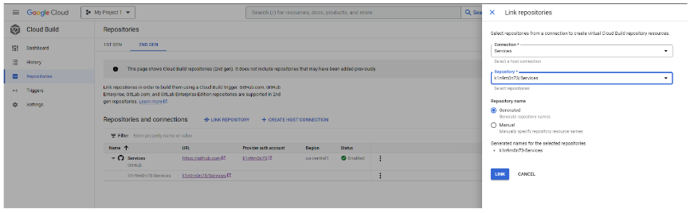
  

**STAGE 2: **Deploy the infrastructure using terraform (the terraform script is added to the github repo) 

1. Create a terraform file named main.tf and in the directory the terraform file is in, run the below commands on PowerShell: 

_gcloud auth login | this with lead to a web prompt to log in using 

terraform init 

terraform plan  

terraform apply _

 
**STAGE 3:** Configure cloud build trigger for CI/CD 

1. Once Terraform is done running, go to the portal to confirm the resources deployed: 

Cloud Run Services 
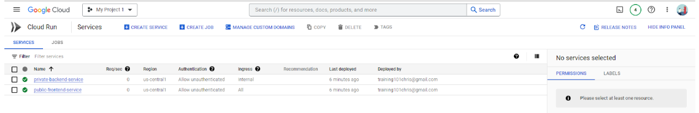 

VPC Connector 

VPC Network 
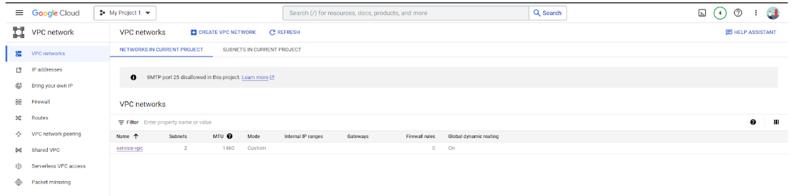

 
2. Next go to the Cloud Run Services and select the backend service 
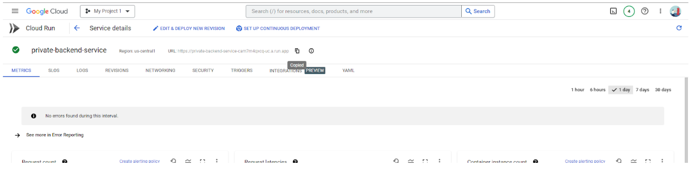

3. Click on continuous deployment at the top of the page, at the side bar select the repository from the linked GitHub account and click on Next 
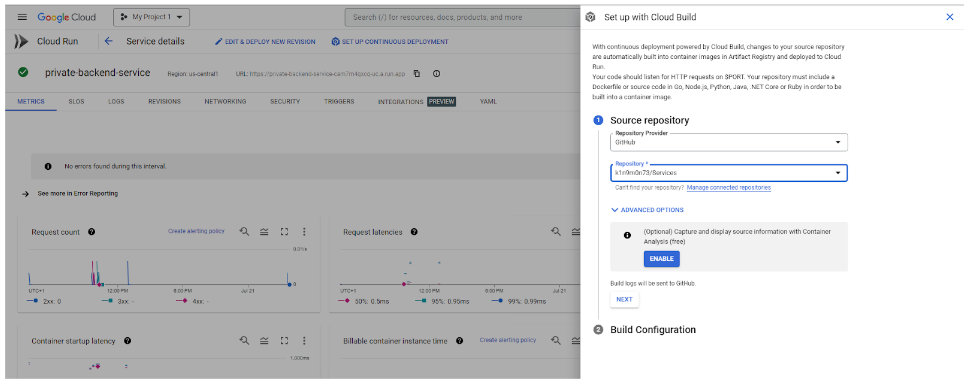
 
4. Select Dockerfile and type in the path to the Dockerfile, for the backend path will be “/backend/Dockerfile” 
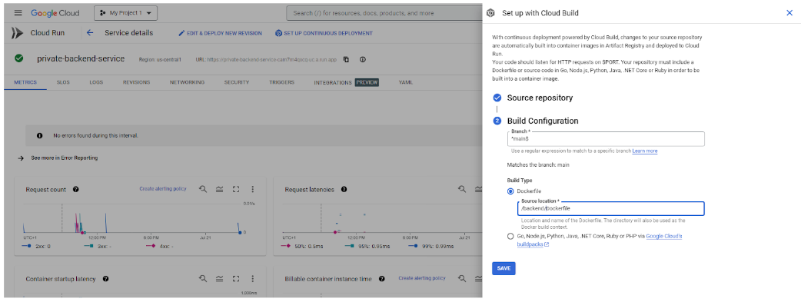

5. Monitor the status from the top of the page  
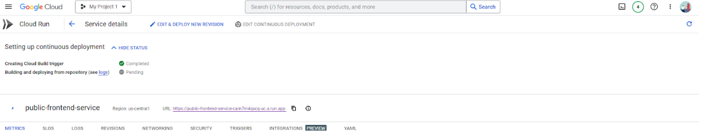
 
6. Once the setup is completed, the Build trigger is now deployed in Cloud Build serving as CI/CD, and changes made to the GitHub repo will trigger a build to the service 
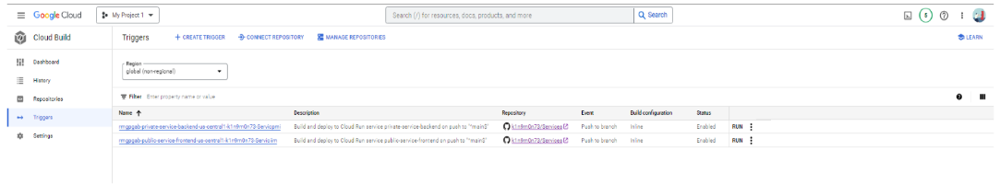
 
7. Go back to the public service and pick the URL, and run on a browser | you will get the front-end page created  
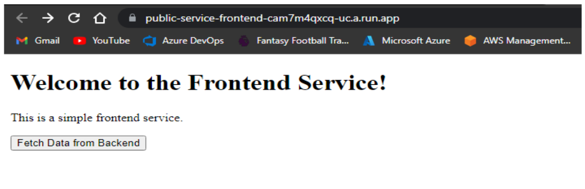
 
8. Perform same operation on the backend and you would get  
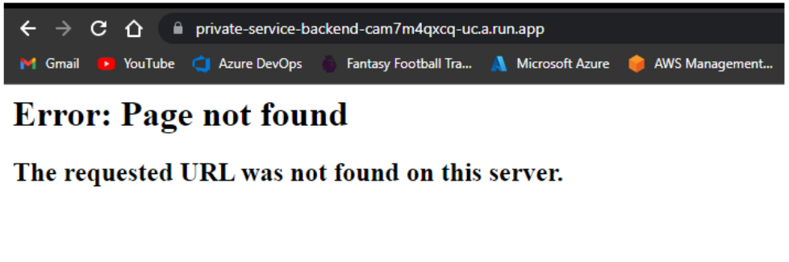

9. When you click the “Fetch Data from Backend” button on the frontend, you will get the response coded on the server  
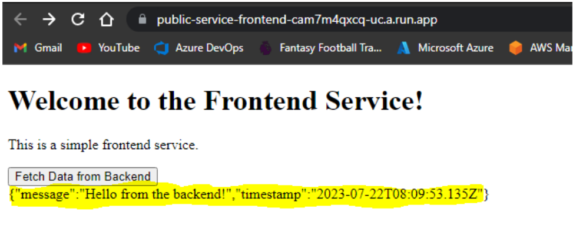
 